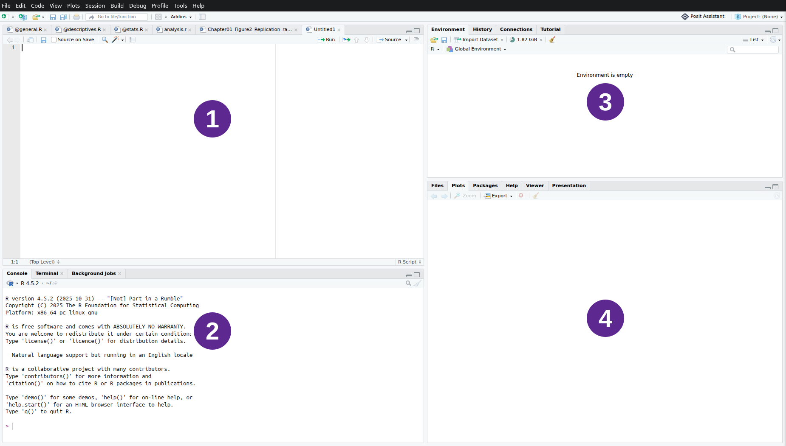
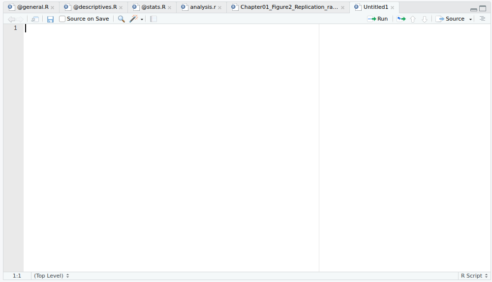
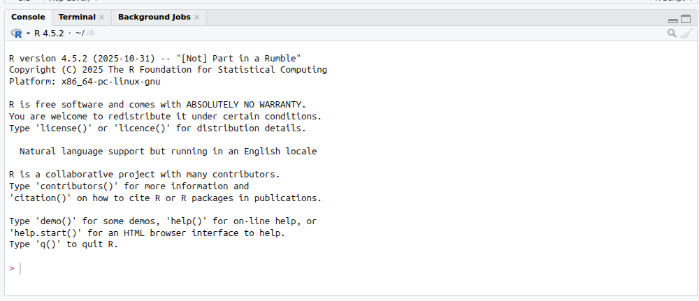
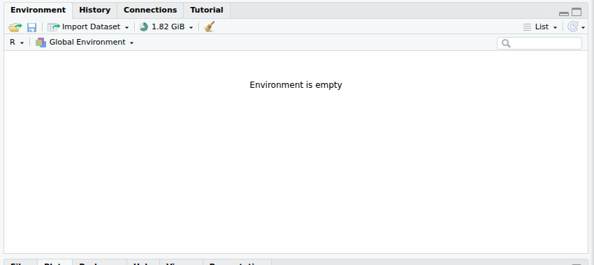

```{r}
#| label: nastaveni
#| include: false
if (!require("here")) install.packages("here")
if (!require("glossary")) install.packages("glossary")

here::i_am("Learning_materials/skripta.qmd")
knitr::opts_knit$set(root.dir = here::here())

library(glossary)

source(here::here("R", "set_r_theme.R"))

local_pojmy <- tempfile(fileext = ".yaml")
tryCatch(
  {
    download.file(
      url = paste0(
        "https://raw.githubusercontent.com/",
        "CUNI-NATUR-Biostatistics/slovnik/main/pojmy.yaml"
      ),
      destfile = local_pojmy,
      quiet = TRUE
    )
    glossary::glossary_path(local_pojmy)
    source(
      url(
        paste0(
          "https://raw.githubusercontent.com/",
          "CUNI-NATUR-Biostatistics/slovnik/main/",
          "R/Functions/render_glossary_term.R"
        )
      )
    )
  },
  error = function(e) {
    source(here::here("R", "Functions", "render_glossary_term.R"))
  }
)

# Kompatibilita s glossary 1.0.0: přesný výběr klíče a bezpečný offline návrat.
source(
  here::here(
    "R",
    "Functions",
    "render_glossary_term_exact.R"
  )
)
```

```{r}
#| label: nastaveni-slovnik
#| echo: false
#| results: asis
if (knitr::is_html_output()) {
  glossary::glossary_style(
    color = "#4B1F6F",
    text_decoration = "underline",
    def_bg = "#FFFFFF",
    def_color = "#2E2E2E"
  )
  cat(
    "<style>",
    "a.glossary.is-open .def { display: inline-block; }",
    "a.glossary:hover .def { display: inline-block; }",
    "a.glossary:active:after { display: none; }",
    "a.glossary:focus .def { display: inline-block; }",
    "</style>",
    sep = "\n"
  )
  cat(
    "<script>",
    "document.addEventListener('click', function(event) {",
    "  var term = event.target.closest('a.glossary');",
    "  document.querySelectorAll('a.glossary.is-open').forEach(function(item) {",
    "    if (item !== term) item.classList.remove('is-open');",
    "  });",
    "  if (term) { event.preventDefault(); term.classList.toggle('is-open'); }",
    "});",
    "</script>",
    sep = "\n"
  )
}
```

## Proč se učit R, když známe tabulkový procesor?

Excel nebo jiný tabulkový procesor je užitečný nástroj. Tabulku v něm rychle otevřete, prohlédnete a můžete ručně opravit několik buněk. Potíž nastane ve chvíli, kdy potřebujete **stejný postup zopakovat**: například příští týden dostanete novou tabulku se stejnými měřeními a chcete z ní vytvořit stejný obrázek.

Při práci pouze pomocí myši si musíte pamatovat každý krok: co jste vybrali, na co jste klikli, jak jste nastavili osy a kam jste výsledek uložili. V R se tyto kroky zapíší jako text. Tento zápis lze uložit, zkontrolovat a znovu spustit.

| Když potřebujeme… | Tabulkový procesor | R |
|---|---|---|
| rychle se podívat na malou tabulku | velmi pohodlné | možné, ale není to hlavní výhoda |
| zopakovat přesně stejný postup | musíme zopakovat klikání | znovu spustíme uložené pokyny |
| ukázat někomu, jak výsledek vznikl | popisujeme kroky zpětně | předáme přesný zapsaný postup |
| opravit jeden krok a obnovit výsledek | často opakujeme další kroky ručně | opravíme řádek a postup spustíme znovu |

::: {.box-rule title="R a Excel se mohou doplňovat"}
Cílem není prohlásit jeden nástroj za vždy lepší. Excel je praktický pro rychlé prohlížení a drobné ruční úpravy. R vyniká tam, kde chceme postup opakovat, kontrolovat, sdílet nebo použít na nová data.
:::

## Co je R?

**R je programovací jazyk a zároveň program, který příkazy v tomto jazyce provádí.** Programovací jazyk je způsob, jak počítači zadat přesné pokyny pomocí textu. Zápisu těchto pokynů říkáme **kód**.

Jeden řádek kódu může počítači říct například:

- sečti dvě čísla;
- ulož výsledek pod určitým jménem;
- načti tabulku ze souboru;
- vytvoř obrázek ze dvou sloupců;
- ulož obrázek na disk.

```r
2 + 3
```

Tento krátký zápis znamená „sečti čísla 2 a 3“. R příkaz přečte, provede výpočet a vrátí výsledek. Později spojíme více takových řádků do uloženého postupu.

R je zdarma a používá se v mnoha oborech. V biologii s jeho pomocí můžeme například načíst měření, vytvořit graf a uchovat přesný postup práce. V této úvodní lekci začneme ovládáním prostředí a několika jednoduchými příkazy.

::: {.box-result title="Hlavní výhoda pro tuto lekci"}
Počítač nemusí hádat, na co jsme minule klikli. Dostane znovu stejný uložený kód a může podle něj zopakovat stejnou práci.
:::

## R a RStudio nejsou totéž

R a RStudio jsou dva různé programy, které spolupracují:

- **R provádí výpočty a příkazy.**
- **RStudio poskytuje okno, ve kterém kód píšeme, posíláme do R, ukládáme a kontrolujeme výsledky.**

Přirovnání může pomoci: R je motor, který vykonává práci; RStudio je pracovní místo s ovládacími prvky, soubory a ukazateli. Přirovnání však nemění doslovnou skutečnost: příkazy vždy provádí R, nikoli samotné RStudio.

Proto se při instalaci nejprve instaluje R a potom RStudio. V počítačové učebně už mají být oba programy připravené.

::: {.box-question title="Kontrola rozdílu"}
Když v RStudiu napíšete příkaz, ale R není nainstalované, který z dvojice programů chybí k provedení výpočtu?
:::

## Jedno okno, čtyři pracovní oblasti

Po otevření RStudia uvidíte jedno okno rozdělené do několika oblastí. Jejich velikost a přesné pořadí se mohou lišit, názvy záložek ale zůstávají důležitými orientačními body.

::: {.content-visible when-format="html"}
<figure>
<svg viewBox="0 0 1850 1051" role="img" aria-label="Snímek obrazovky RStudia se čtyřmi očíslovanými pracovními oblastmi." style="display:block;width:100%;height:auto;margin:0 auto;">
  <image href="figures/rstudio-fresh-install.png" x="0" y="0" width="1850" height="1051"></image>
  <g fill="#5D2890" stroke="#FFFFFF" stroke-width="8">
    <circle cx="500" cy="280" r="48"></circle>
    <circle cx="500" cy="780" r="48"></circle>
    <circle cx="1425" cy="240" r="48"></circle>
    <circle cx="1425" cy="750" r="48"></circle>
  </g>
  <g fill="#FFFFFF" font-family="Arial, sans-serif" font-size="58" font-weight="700" text-anchor="middle" dominant-baseline="central">
    <text x="500" y="280">1</text>
    <text x="500" y="780">2</text>
    <text x="1425" y="240">3</text>
    <text x="1425" y="750">4</text>
  </g>
</svg>
<figcaption>Skutečné okno RStudia: 1 Source, 2 Console, 3 Environment a 4 záložky Files, Plots, Packages a Help.</figcaption>
</figure>
:::

::: {.content-visible unless-format="html"}
{fig-alt="Snímek obrazovky RStudia se čtyřmi očíslovanými pracovními oblastmi." width="100%"}
:::

Snímek vytvořil uživatel Wikimedia Commons Rcragun a zveřejnil jej pod licencí [CC BY-SA 4.0](https://creativecommons.org/licenses/by-sa/4.0/). [Původní soubor a úplné informace o licenci](https://commons.wikimedia.org/wiki/File:RStudio_-_Fresh_Install.png).

Čtyři oblasti budeme probírat samostatně. Zatím je pouze najděte na svém monitoru:

1. Source vlevo nahoře;
2. Console vlevo dole;
3. Environment vpravo nahoře;
4. Files, Plots, Packages a Help vpravo dole.

## Source: místo pro uložený kód

::: {.content-visible when-format="html"}
<figure>
<svg viewBox="0 0 1000 575" role="img" aria-label="Výřez skutečného okna RStudia s editorem Source." style="display:block;width:88%;height:auto;margin:0 auto;">
  <image href="figures/rstudio-fresh-install.png" x="0" y="-55" width="1850" height="1051"></image>
</svg>
<figcaption>Panel Source je textový editor. Zde vznikají a zůstávají uložené textové pokyny pro R.</figcaption>
</figure>
:::

::: {.content-visible unless-format="html"}
{fig-alt="Výřez skutečného okna RStudia s editorem Source." width="88%"}
:::

**Source je textový editor.** Píšete v něm R skripty: obyčejné textové soubory s koncovkou `.R`. Každý otevřený soubor má nahoře vlastní záložku. Vlevo se zobrazují čísla řádků a blikající kurzor ukazuje, kam budete psát.

Co je důležité:

- kód v Source můžete upravovat stejně jako text;
- tlačítkem Save nebo zkratkou **Ctrl + S** jej uložíte na disk;
- znak `#` začíná komentář, který slouží jako poznámka pro člověka;
- napsání řádku do Source jej samo o sobě **nespustí**.

Když je soubor od posledního uložení změněný, RStudio u jeho názvu zobrazí značku neuložené změny. Uložení chrání text skriptu, ale neprovádí jeho příkazy.

::: {.box-question title="Najděte ovládací prvky"}
Najděte na svém monitoru čísla řádků, záložku otevřeného souboru a tlačítko Save. Je v Source právě otevřený nějaký soubor?
:::

## Console: místo, kde R čeká na příkaz

::: {.content-visible when-format="html"}
<figure>
<svg viewBox="0 0 1000 431" role="img" aria-label="Výřez skutečného okna RStudia s panelem Console a značkou větší než." style="display:block;width:88%;height:auto;margin:0 auto;">
  <image href="figures/rstudio-fresh-install.png" x="0" y="-620" width="1850" height="1051"></image>
</svg>
<figcaption>Panel Console ukazuje značku &gt;, zadané příkazy, výsledky a zprávy od R.</figcaption>
</figure>
:::

::: {.content-visible unless-format="html"}
{fig-alt="Výřez skutečného okna RStudia s panelem Console a značkou větší než." width="88%"}
:::

**Console je přímé spojení s běžícím programem R.** Značka `>` znamená: „R je připravené přijmout další příkaz.“ Kliknete-li za tuto značku, můžete příkaz napsat přímo a klávesou **Enter** jej okamžitě spustit.

Console potom obsahuje několik druhů řádků:

- příkaz, který jste zadali;
- výsledek výpočtu;
- případnou zprávu, varování nebo chybu;
- novou značku `>`, až je R připravené pokračovat.

Šipkou nahoru můžete vyvolat dříve zadaný příkaz a upravit jej. Zkratka **Ctrl + L** pouze vyčistí text, který právě vidíte v Console. Nevrátí provedené příkazy zpět a nevymaže uložené soubory.

Console je vhodná pro rychlé vyzkoušení jednoho příkazu. Není však dobrým zápisníkem: řádky zde nejsou uspořádaný, uložený postup, který bychom mohli spolehlivě předat nebo znovu spustit.

## Jak se příkaz dostane ze skriptu do R

Source a Console nejsou dvě alternativní místa pro totéž. Mají odlišné role a při běžné práci spolupracují:

1. V **Source** napíšete a uložíte řádek kódu.
2. Kurzor necháte na daném řádku a stisknete **Ctrl + Enter** (na macOS **Cmd + Enter**).
3. RStudio odešle řádek do **Console**.
4. **R** příkaz provede a Console zobrazí výsledek nebo zprávu.

::: {.box-rule title="Jedna cesta příkazu"}
**Source:** `2 + 3` → **Ctrl + Enter** → **Console:** `> 2 + 3` → **R vypočítá a zobrazí výsledek**
:::

| Činnost | Co se stane |
|---|---|
| napíšu řádek do Source | změním text skriptu |
| uložím skript | text se zapíše do souboru `.R` |
| stisknu Ctrl + Enter | aktuální řádek se odešle do R |
| R příkaz dokončí | výsledek nebo zpráva se objeví v Console |

::: {.box-question title="Předpovězte místo výsledku"}
Napíšete `10 + 5` do Source a pouze stisknete Ctrl + S. Objeví se už výsledek v Console? Co musíte udělat navíc?
:::

## Environment: co si R právě pamatuje

::: {.content-visible when-format="html"}
<figure>
<svg viewBox="0 0 850 380" role="img" aria-label="Výřez skutečného okna RStudia s prázdným panelem Environment." style="display:block;width:82%;height:auto;margin:0 auto;">
  <image href="figures/rstudio-fresh-install.png" x="-1000" y="-55" width="1850" height="1051"></image>
</svg>
<figcaption>Panel Environment ukazuje pojmenované výsledky, které si právě běžící R dočasně pamatuje.</figcaption>
</figure>
:::

::: {.content-visible unless-format="html"}
{fig-alt="Výřez skutečného okna RStudia s prázdným panelem Environment." width="82%"}
:::

R si během práce může uchovávat výsledky pod jmény. Takovým pojmenovaným výsledkům říkáme **objekty**. Panel Environment nabízí přehled objektů, které má právě běžící R k dispozici.

Environment není složka na disku a není to náhrada za skript:

- objekt se objeví až po provedení příkazu, který jej vytvoří;
- změna textu ve skriptu sama objekt nezmění;
- uložený skript zůstává v souboru, zatímco Environment ukazuje pouze aktuální pracovní paměť R.

Na snímku je Environment prázdný. Později vytvoříme první objekt a přímo uvidíme, jak se panel změní.

## Files, Plots a Help: soubory, obrázky a nápověda

::: {.content-visible when-format="html"}
<figure>
<svg viewBox="0 0 850 636" role="img" aria-label="Výřez skutečného okna RStudia se záložkami Files, Plots, Packages a Help." style="display:block;width:82%;height:auto;margin:0 auto;">
  <image href="figures/rstudio-fresh-install.png" x="-1000" y="-415" width="1850" height="1051"></image>
</svg>
<figcaption>Pravá dolní oblast sdružuje několik záložek. Přepnutím záložky se mění obsah stejného místa.</figcaption>
</figure>
:::

::: {.content-visible unless-format="html"}
{fig-alt="Výřez skutečného okna RStudia se záložkami Files, Plots, Packages a Help." width="82%"}
:::

V jedné oblasti se střídá několik záložek:

- **Files** zobrazuje složky a soubory;
- **Plots** zobrazuje obrázky vytvořené v R;
- **Help** otevírá vysvětlující stránky k příkazům R;
- **Packages** ukazuje nainstalovaná rozšíření R.

Kliknutím na název záložky přepnete obsah panelu. Nic tím nemažete. Například obrázek může být dostupný v Plots, i když jste se mezitím přepnuli do Help.

::: {.box-question title="Kontrola celé mapy"}
Ukažte na svém monitoru místo, kde byste hledali uložený skript, okamžitý výsledek příkazu, pojmenovaný objekt, obrázek a nápovědu.
:::

## Složka drží soubory jedné práce pohromadě

Složku už znáte z Průzkumníka souborů. Může obsahovat soubory a další podsložky. Pro jednu práci je užitečné držet související věci pohromadě.

Soubor CSV je jednoduchý textový soubor s tabulkou a poznáte jej podle koncovky `.csv`. V našem CSV bude každý řádek patřit jednomu tučňákovi a každý sloupec jednomu zaznamenanému údaji.

Naše složka bude vypadat takto:

```text
prvni-kroky-r/
├── data/
│   └── palmer_penguins.csv
├── vystupy/
└── prvni_kroky.R
```

Čteme ji shora dolů:

- `prvni-kroky-r` je hlavní složka celé práce;
- `data` je podsložka pro vstupní tabulky;
- `vystupy` je podsložka pro obrázky a jiné výsledky;
- `prvni_kroky.R` je uložený skript.

Stejné složky a soubory můžete vidět v Průzkumníku Windows i v záložce Files v RStudiu. RStudio si nevytváří zvláštní kopii: obě místa ukazují soubory uložené na disku.

::: {.box-rule title="Jedna práce, jedna hlavní složka"}
Když jsou skript, data a výstupy v jedné přehledné složce, je snazší práci otevřít, přenést a znovu spustit.
:::

## Soubor `.Rproj` otevře složku jako projekt

RStudio Project je obyčejná složka doplněná malým souborem s koncovkou `.Rproj`. Tento soubor říká RStudiu: „Otevři tuto složku jako jeden pracovní celek.“

Po vytvoření projektu přibude do struktury jeden soubor:

```text
prvni-kroky-r/
├── prvni-kroky-r.Rproj
├── data/
│   └── palmer_penguins.csv
├── vystupy/
└── prvni_kroky.R
```

Projekt přináší tři praktické výhody:

1. RStudio nahoře zobrazuje název otevřeného projektu, takže víte, na které práci právě jste.
2. Záložka Files začíná v hlavní složce projektu.
3. Cesty k souborům můžeme zapisovat od této společné hlavní složky místo dlouhé adresy konkrétního počítače.

Soubor `.Rproj` neobsahuje data ani kód analýzy. Slouží jako vstupní dveře do správné složky a jejího nastavení v RStudiu.

## Vytvoříme projekt a první skript

V RStudiu zvolte **File → New Project… → New Directory → New Project**. Do pole **Directory name** napište `prvni-kroky-r`. Tím určíte název nové složky. Tlačítkem **Browse…** vyberte místo, které později znovu najdete, a klikněte na **Create Project**. RStudio novou složku vytvoří, přidá do ní soubor `.Rproj` a otevře ji jako projekt.

Po otevření projektu zkontrolujte jeho název vpravo nahoře. Potom:

1. V záložce **Files** klikněte na **New Folder**, napište `data` a potvrďte vytvoření složky.
2. Stejným tlačítkem vytvořte složku `vystupy`.
3. Zkopírujte připravený soubor `palmer_penguins.csv` do složky `data`. V učebně jej poskytne vyučující spolu s materiály; při samostudiu jej můžete stáhnout z [veřejné adresy dat](https://cuni-natur-biostatistics.github.io/L00/current/data/palmer_penguins.csv). Při stahování zvolte **Uložit jako…**, otevřete složku projektu a v ní podsložku `data`.
4. V RStudiu otevřete v záložce Files složku `data` a zkontrolujte, že v ní soubor vidíte. Další práce tak funguje i bez připojení k internetu.
5. Zvolte **File → New File → R Script**.
6. Napište první komentář.
7. Pomocí **File → Save As…** soubor uložte jako `prvni_kroky.R` přímo do hlavní složky projektu.

```r
# Moje první práce v R
```

Znak `#` říká R, že zbytek řádku je komentář pro člověka. Komentář může vysvětlit, proč další příkaz provádíme. R jej nebude počítat.

::: {.box-rule title="Kam psát následující kód"}
Od této chvíle patří každý ukázkový blok kódu do souboru `prvni_kroky.R` v panelu Source, pokud u něj výslovně není napsáno **pouze Console**. Řádky ze skriptu spouštějte pomocí **Ctrl + Enter** a průběžně ukládejte pomocí **Ctrl + S**.
:::

::: {.box-question title="Kontrola složky a projektu"}
Vidíte v Files soubor `.Rproj`, skript `prvni_kroky.R` a obě podsložky? Je skript uložený, nebo jeho záložka stále ukazuje neuloženou změnu?
:::

## R jako kalkulačka a první oprava

Všechny příkazy v této části jsou krátké pokusy určené **pouze pro Console**. Neúplný příkaz do uloženého skriptu nepatří.

Klikněte v Console za značku `>`, napište následující výraz a stiskněte **Enter**:

```r
2 + 3
```

Console ukáže zadaný příkaz, vypočtený výsledek a novou značku `>`. Stiskněte šipku nahoru: předchozí příkaz se znovu objeví za značkou. Změňte `3` na `8` a stiskněte Enter.

Po prvním výpočtu uvidíte v Console:

```{r}
#| label: vysledek-prvniho-vypoctu
#| echo: false
2 + 3
```

Číslo `r 2 + 3` je hledaný výsledek. Zápis `[1]` před ním je pomocná značka R: říká, že za ní začíná první zobrazená hodnota. Pro tuto lekci ji nemusíte používat.

Teď zadejte neúplný příkaz:

```r
(2 + 3
```

R nemůže výraz dokončit, protože chybí pravá závorka. Místo obvyklé značky `>` proto ukáže `+`: čeká na pokračování téhož příkazu. Klávesou **Esc** čekání zrušte. Potom napište opravený výraz:

```{r}
#| label: opravena-zavorka
#| echo: true
(2 + 3)
```

::: {.box-warning title="Značka + zde není sčítání"}
Když se `+` objeví úplně vlevo na novém řádku Console, R obvykle čeká na dokončení předchozího příkazu. Zkontrolujte závorky; Esc vrátí běžnou značku `>`.
:::

## Objekt dá výsledku jméno

Přímý výpočet v Console rychle vrátí číslo, ale další řádek neví, jak se k tomuto výsledku odkazovat. Zápis `<-` umožní výsledek pojmenovat a uložit do pracovní paměti R.

Do skriptu v Source napište:

```{r}
#| label: prvni-objekt
#| echo: true
# Uložíme délku lekce v minutách
delka_lekce_min <- 90
```

Čteme: „Do objektu `delka_lekce_min` ulož hodnotu 90.“ Před spuštěním se podívejte do Environment. Objekt tam ještě není, protože jste zatím změnili pouze text skriptu.

Jméno `delka_lekce_min` neobsahuje mezery: jednotlivá slova oddělují podtržítka `_`. Konec `_min` připomíná, že je délka uvedena v minutách. Podobně budeme později používat začátky `data_` pro celou tabulku a `vec_` pro jednu posloupnost hodnot.

Nechte kurzor na řádku s `<-` a stiskněte **Ctrl + Enter**. Sledujte tři místa:

1. řádek zůstává uložený v Source;
2. provedený příkaz se objeví v Console;
3. objekt `delka_lekce_min` se objeví v Environment.

Chcete-li hodnotu vypsat, napište do skriptu jméno objektu a řádek spusťte:

```{r}
#| label: vypsani-prvniho-objektu
#| echo: true
delka_lekce_min
```

::: {.box-question title="Změna skriptu ještě není změna objektu"}
Ve Source změňte hodnotu 90 na 80, ale řádek nespouštějte. Jakou hodnotu stále ukazuje Environment? Co ji skutečně změní?
:::

## Funkce provede konkrétní úkol

Funkce je pojmenovaný nástroj pro určitý úkol. Za názvem funkce následují kulaté závorky. Do nich zapisujeme argumenty: vstupy a nastavení, se kterými má funkce pracovat.

Než příkaz spustíme, přečteme jej po částech:

- `round` je název funkce pro zaokrouhlení;
- `x = 3.14159` určuje číslo, se kterým pracujeme;
- `digits = 2` určuje počet desetinných míst;
- hodnota vypsaná v Console bude výsledek funkce.

Nyní příkaz napište do skriptu v Source a spusťte pomocí Ctrl + Enter:

```{r}
#| label: funkce-round
#| echo: true
round(
  x = 3.14159,
  digits = 2
)
```

Console vypíše výsledek `r round(x = 3.14159, digits = 2)`. Pojmenované argumenty zápis trochu prodlužují, ale začátečník z nich snadněji pozná význam každé hodnoty.

Nápovědu k funkci otevřete otazníkem před jejím názvem. Také tento řádek patří do skriptu:

```{r}
#| label: napoveda-round
#| echo: true
#| eval: false
?round
```

V záložce Help najděte části **Usage** a **Arguments**. Usage ukazuje tvar volání funkce; Arguments vysvětluje její vstupy. Nemusíte rozumět celé stránce.

## Balíček přidá další možnosti

Základní instalace R obsahuje mnoho funkcí. **Balíček** je doplněk, který může přidat další funkce, dokumentaci nebo ukázková data. Instalace stáhne balíček do počítače; použití konkrétního obsahu je samostatný krok.

Oba příkazy v této části zadejte pouze do **Console**. Ani jeden nepatří do pracovního skriptu `prvni_kroky.R`.

Balíček nainstalujete obvykle jen jednou. Příkaz níže čteme takto: funkce `install.packages()` má nainstalovat balíček, jehož jméno uvádíme jako nastavení `pkgs`. Uvozovky označují text — zde přesný název balíčku `palmerpenguins`.

```{r}
#| label: instalace-palmerpenguins
#| echo: true
#| eval: false
install.packages(pkgs = "palmerpenguins")
```

Po dokončení instalace si necháme vypsat názvy sloupců ukázkové tabulky z balíčku. Funkce `names()` vypisuje názvy sloupců a nastavení `x` určuje, kterou tabulku použijeme. Zápis `palmerpenguins::penguins` čteme „vezmi objekt `penguins` z balíčku `palmerpenguins`“; dvojtečka `::` tedy vybírá obsah z konkrétního balíčku.

```{r}
#| label: data-z-balicku
#| echo: true
#| eval: false
names(x = palmerpenguins::penguins)
```

V Console se objeví seznam názvů sloupců. Mezi nimi uvidíte `species`, `flipper_length_mm` a `body_mass_g`. Tím jsme použili jednu konkrétní tabulku přímo z balíčku.

```{r}
#| label: kontrola-zavislosti-palmerpenguins
#| include: false
invisible(palmerpenguins::penguins)
```

::: {.box-warning title="Instalaci zkoušíme nejvýše pět minut"}
Instalace může v učebně selhat kvůli síti nebo oprávněním. Pokud do pěti minut nefunguje, pokračujte s připraveným CSV souborem. Všechny další kroky fungují bez balíčku.
:::

## Jeden řádek, jeden tučňák

Než budeme tabulku načítat příkazem, podíváme se, co skutečně obsahuje.

```{r}
#| label: tabulka-tucnaku
#| echo: false
#| message: false
#| warning: false
data_tucnaci_pribeh <-
  read.csv(
    file = here::here("data", "palmer_penguins.csv")
  )

knitr::kable(
  x = head(
    x = data_tucnaci_pribeh,
    n = 5
  ),
  col.names = c(
    "druh",
    "délka křídla (mm)",
    "tělesná hmotnost (g)"
  ),
  caption = "Prvních pět řádků připraveného souboru Palmer Penguins."
)
```

`r render_glossary_term("jednotka-pozorovani", display = "Jednotkou pozorování")` je jeden konkrétní tučňák. Jedno `r render_glossary_term("pozorovani", display = "pozorování")` tvoří jedna řádka tabulky. Sloupce uchovávají tři zaznamenané `r render_glossary_term("promenna", display = "proměnné")`:

- `species` — druh tučňáka;
- `flipper_length_mm` — délka křídla v milimetrech;
- `body_mass_g` — tělesná hmotnost v gramech.

Například první řádka patří jednomu tučňákovi druhu `r data_tucnaci_pribeh[["species"]][[1]]`. Jeho délka křídla je `r data_tucnaci_pribeh[["flipper_length_mm"]][[1]]` mm a hmotnost `r data_tucnaci_pribeh[["body_mass_g"]][[1]]` g.

::: {.box-data title="Původ dat" collapse="true"}
Data pocházejí z projektu [Palmer Penguins](https://allisonhorst.github.io/palmerpenguins/). Původní měření zpřístupnily Dr Kristen Gorman a Palmer Station Long Term Ecological Research program pod licencí CC0. Kurzový CSV soubor zachovává pořadí řádků a obsahuje `r nrow(data_tucnaci_pribeh)` záznamů ve třech uvedených sloupcích. Podrobný popis původu a přípravy je v souboru `LICENSE.md` repozitáře lekce.
:::

## Cesta k datům začíná ve složce projektu

Soubor s daty leží na tomto místě:

```text
prvni-kroky-r/
└── data/
    └── palmer_penguins.csv
```

Cestu `data/palmer_penguins.csv` čteme jako dva kroky: „z hlavní složky projektu vstup do podsložky `data` a v ní najdi soubor `palmer_penguins.csv`.“ Protože začínáme ve společné hlavní složce projektu, říkáme jí **relativní cesta**.

Funkce `read.csv()` otevře soubor a přečte z něj tabulku. Nastavení `file` určuje cestu k souboru. Cesta je text, proto je v uvozovkách. Výsledek uložíme pod jménem `data_tucnaci`; začátek `data_` nám připomíná, že objekt obsahuje celou tabulku.

Do skriptu vložte a spusťte:

```{r}
#| label: nacteni-csv
#| echo: true
# Načteme CSV ze složky data uvnitř projektu
data_tucnaci <-
  read.csv(
    file = "data/palmer_penguins.csv"
  )
```

Po spuštění řádků se objekt `data_tucnaci` objeví v Environment.

Do skriptu nekopírujte dlouhou adresu, která začíná uživatelskou složkou konkrétního počítače. Relativní cesta popisuje stejné místo uvnitř projektu každému, kdo otevře jeho hlavní složku.

## Načetli jsme správnou tabulku?

Úspěšné provedení příkazu ještě neznamená, že jsme načetli správný soubor. Pro první kontrolu zodpovíme tři jednoduché otázky:

1. Jak vypadají první řádky?
2. Jak se jmenují sloupce?
3. Kolik řádků tabulka obsahuje?

Každá otázka má vlastní funkci. `head()` zobrazí začátek tabulky; nastavení `x` určuje tabulku a `n = 6` počet zobrazených řádků. `names()` vypíše názvy sloupců. `nrow()` vrátí počet řádků.

```{r}
#| label: kontrola-dat
#| echo: true
# Prvních šest řádků
head(
  x = data_tucnaci,
  n = 6
)

# Jména všech sloupců
names(x = data_tucnaci)

# Počet řádků
nrow(x = data_tucnaci)
```

Výstup `head()` můžeme porovnat s tabulkou výše. `names()` má vrátit tři očekávaná jména sloupců. `nrow()` vrátí `r nrow(data_tucnaci)` řádků, tedy stejný počet zaznamenaných tučňáků.

Jestliže názvy, první řádky a počet tučňáků odpovídají očekávání, máme pro další krok správnou tabulku.

## Dvě měření se stanou jedním bodem

Chceme zobrazit délku křídla a tělesnou hmotnost každého tučňáka společně. Nejprve sledujme jedinou řádku:

| Co přečteme z první řádky | Kam hodnota míří v obrázku |
|---|---|
| délka křídla `r data_tucnaci[["flipper_length_mm"]][[1]]` mm | vodorovná poloha bodu |
| hmotnost `r data_tucnaci[["body_mass_g"]][[1]]` g | svislá poloha bodu |

Jeden tučňák tak vytvoří jeden bod se dvěma souřadnicemi. Stejným způsobem R umístí bod pro každý další řádek tabulky. Takovému obrázku říkáme `r render_glossary_term("bodovy-graf", display = "bodový graf")` (anglicky *scatter plot*).

Znak `$` vybírá z tabulky jeden sloupec podle jména. Vybraný sloupec je posloupnost hodnot; v R se takové posloupnosti říká **vektor**. Začátek jména `vec_` nám bude připomínat, že objekt obsahuje právě jednu takovou posloupnost. Oba sloupce s měřeními nyní uložíme do přehledně pojmenovaných objektů. Následující blok patří do skriptu:

```{r}
#| label: vektory-pro-graf
#| echo: true
# Vodorovná souřadnice bodů
vec_delka_kridla <-
  data_tucnaci$flipper_length_mm

# Svislá souřadnice bodů
vec_hmotnost <-
  data_tucnaci$body_mass_g
```

Potom vytvoříme obrázek funkcí `plot()`. Nastavení `x` a `y` určují hodnoty pro vodorovnou a svislou osu. `xlab` a `ylab` určují text popisků os; uvozovky opět označují text. Nastavení `pch = 16` vykreslí plné kruhové body a `col = "grey40"` je obarví tmavě šedě.

```{r}
#| label: bodovy-graf-tucnaku
#| echo: true
plot(
  x = vec_delka_kridla,
  y = vec_hmotnost,
  xlab = "Délka křídla (mm)",
  ylab = "Tělesná hmotnost (g)",
  pch = 16,
  col = "grey40"
)
```

Výsledek se objeví v záložce Plots. Zkontrolujte, že vodorovná osa ukazuje délku křídla, svislá osa hmotnost a každý řádek tabulky má v grafu jeden bod.

::: {.box-question title="Najděte jeden bod"}
Podle první řádky tabulky určete, kde přibližně hledat bod s délkou křídla `r data_tucnaci[["flipper_length_mm"]][[1]]` mm a hmotností `r data_tucnaci[["body_mass_g"]][[1]]` g.
:::

## Obrázek uložíme jako soubor

Obrázek v záložce Plots je zobrazený výsledek aktuální práce. Ještě však nemusí existovat jako samostatný soubor na disku. Aby jej bylo možné otevřít mimo RStudio nebo někomu poslat, uložíme jej jako PNG. PNG je běžný formát obrázkového souboru, který poznáte podle koncovky `.png`.

Postup má tři části:

1. `png()` otevře cílový soubor;
2. `plot()` do něj nakreslí obrázek;
3. `dev.off()` soubor uzavře a dokončí zápis.

Nastavení `filename` určuje cestu a jméno vytvářeného souboru: `vystupy/tucnaci.png`.

```{r}
#| label: ulozeni-grafu
#| echo: true
#| eval: false
# 1. Otevřeme cílový PNG soubor
png(
  filename = "vystupy/tucnaci.png"
)

# 2. Nakreslíme stejný obrázek do souboru
plot(
  x = vec_delka_kridla,
  y = vec_hmotnost,
  xlab = "Délka křídla (mm)",
  ylab = "Tělesná hmotnost (g)",
  pch = 16,
  col = "grey40"
)

# 3. Soubor uzavřeme a dokončíme jeho zápis
dev.off()
```

Po spuštění bloku přepněte do Files, otevřete složku `vystupy` a zkontrolujte soubor `tucnaci.png`. Je to běžný soubor na disku: zůstane uložený, i když RStudio zavřete.

::: {.box-rule title="Plots není totéž co soubor"}
Plots ukazuje obrázek uvnitř RStudia. `vystupy/tucnaci.png` je uložený soubor. Záložka Files umožní ověřit, že soubor skutečně vznikl.
:::

## Co znamená restartovat R?

Dosud jsme postupně vytvářeli objekty v pracovní paměti R. Výsledek proto může fungovat jen díky staršímu příkazu z Console, který ve skriptu chybí. Po restartu takový chybějící krok odhalíme.

**Restartovat R znamená ukončit právě běžící program R uvnitř RStudia a spustit nový, čistý běh R.** RStudio samotné zůstane otevřené.

| Co po restartu zůstane | Co se vyčistí |
|---|---|
| uložený skript v Source a na disku | objekty v Environment |
| CSV soubor ve složce `data` | pracovní paměť předchozího běhu R |
| PNG soubor ve složce `vystupy` | nedokončený příkaz v Console |
| otevřený RStudio Project | to, co si R pamatovalo z provedených příkazů |

Před restartem vždy uložte skript pomocí **Ctrl + S**. Potom zvolte **Session → Restart R** nebo použijte **Ctrl + Shift + F10**. V Console se objeví úvodní text nově spuštěného R a Environment bude prázdný.

::: {.box-question title="Předpověď před restartem"}
Které z těchto věcí po restartu uvidíte dál: `prvni_kroky.R`, `data_tucnaci` v Environment, `palmer_penguins.csv`, `tucnaci.png`? Svou odpověď ověřte až po uložení skriptu.
:::

## Dokáže skript obnovit naši práci?

Po restartu jsou soubory stále na disku, ale Environment je prázdný. Uložený skript teď musí znovu vytvořit vše potřebné ve správném pořadí.

Ve skriptu mají zůstat tyto části:

1. komentáře a jednoduché výpočty, které chcete uchovat;
2. vytvoření objektu `delka_lekce_min`;
3. načtení CSV do `data_tucnaci`;
4. kontrolní příkazy;
5. vytvoření obou vektorů;
6. zobrazení grafu;
7. vytvoření PNG souboru.

Naopak do něj nepatří Console-only ukázky `install.packages()` a `palmerpenguins::penguins`.

Uložte skript. Nahoře v panelu Source — tedy nad textem skriptu — najděte tlačítko **Source**. Toto tlačítko spustí celý soubor od prvního řádku až po poslední. To je jiné než **Ctrl + Enter**, které spouští pouze aktuální řádek nebo označenou část. Klikněte na tlačítko Source a sledujte, zda se znovu objeví:

- objekty v Environment;
- `r render_glossary_term("bodovy-graf", display = "bodový graf")` v Plots;
- soubor `vystupy/tucnaci.png` v Files.

::: {.box-result title="Co jsme právě ověřili"}
Postup je reprodukovatelný, pokud po čistém spuštění R nepotřebujete ručně doplňovat příkazy v Console, vytvářet chybějící objekty ani měnit cestu pro konkrétní počítač. Uložený skript znovu vytvoří výsledek z uložených vstupů.
:::

## Co už umíme

Na začátku jsme vyšli z práce se známými tabulkami. Nyní umíte vysvětlit několik důležitých rozdílů:

| Dvojice | Rozdíl |
|---|---|
| R × RStudio | R provádí příkazy; RStudio poskytuje pracovní prostředí |
| Source × Console | Source uchovává skript; Console komunikuje s právě běžícím R |
| Save × Ctrl + Enter | Save uloží text; Ctrl + Enter odešle kód k provedení |
| Environment × Files | Environment ukazuje dočasnou paměť; Files ukazuje soubory na disku |
| složka × RStudio Project | projekt je známá složka doplněná souborem `.Rproj` a otevřená jako jeden celek |
| Plots × PNG | Plots je zobrazení v RStudiu; PNG je uložený soubor |

::: {.box-question title="Výstupní kontrola"}
Ukažte ve svém projektu uložený skript, CSV soubor, objekt v Environment, graf v Plots a PNG soubor. Potom vlastními slovy vysvětlete, jak se jeden řádek dostane ze Source do R a co při restartu zmizí.
:::

## Instalace R a RStudia na vlastním počítači {.unnumbered}

Tato část je určena pro samostudium mimo počítačovou učebnu. V učebně mají být R i RStudio připravené před začátkem lekce.

1. Stáhněte a nainstalujte R z oficiálního webu [The Comprehensive R Archive Network](https://cran.r-project.org/). Vyberte svůj operační systém a běžnou základní instalaci.
2. Stáhněte a nainstalujte bezplatnou variantu RStudio Desktop z oficiální stránky [Posit Downloads](https://posit.co/downloads/).
3. Spusťte RStudio. Klikněte do Console za `>`, napište `1 + 1` a stiskněte Enter. Pokud R zobrazí vypočtený výsledek a novou značku `>`, základní instalace funguje.

R instalujte před RStudiem. Pro tuto lekci stačí R a bezplatná varianta RStudio Desktop.

## Když se práce zastaví {.unnumbered}

Postupujte podle toho, co právě vidíte:

1. **Nevím, kam psát.** Pro uložený postup klikněte do skriptu v Source; pro jednorázový pokus klikněte za `>` v Console.
2. **Napsal/a jsem řádek, ale nic se nestalo.** Kód v Source je nutné spustit pomocí Ctrl + Enter; samotné psaní ani Ctrl + S příkaz neprovedou.
3. **Console ukazuje `+`.** R čeká na dokončení příkazu. Stiskněte Esc a zkontrolujte závorky a uvozovky.
4. **Console ukazuje chybu.** Přečtěte poslední zprávu, najděte jméno objektu, funkce nebo souboru a zkontrolujte překlep.
5. **Chybí objekt.** Spusťte dřívější řádky skriptu, které jej vytvářejí; nevyrábějte jej ručně jen v Console.
6. **Nelze najít CSV.** Ověřte otevřený projekt, složku `data` a přesný název `palmer_penguins.csv` v Files.
7. **Selhala instalace balíčku.** Po pěti minutách pokračujte s připraveným CSV; další části balíček nepotřebují.
8. **Po restartu postup nefunguje.** Spusťte skript od prvního řádku a opravte první místo, kde se zastaví.

Pokud oprava není zřejmá, uložte skript a poznamenejte si přesné znění poslední zprávy v Console. Přesná zpráva a problematický řádek jsou užitečnější než obecné „R nefunguje“.

## Slovníček pojmů {.unnumbered}

Pojmy použité v těchto materiálech a jejich definice:

```{r}
#| label: slovnicek
#| echo: false
#| results: asis
if (knitr::is_html_output()) {
  glossary::glossary_table()
} else {
  cat(
    paste0(
      "Interaktivní slovníček je dostupný online: ",
      "https://cuni-natur-biostatistics.github.io/slovnik/"
    )
  )
}
```
